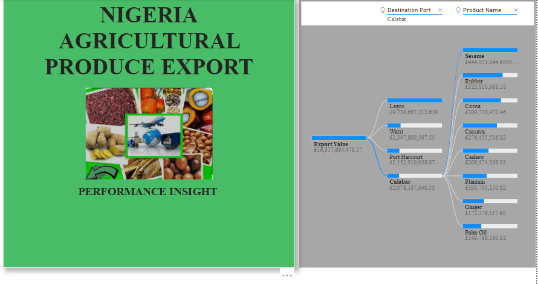
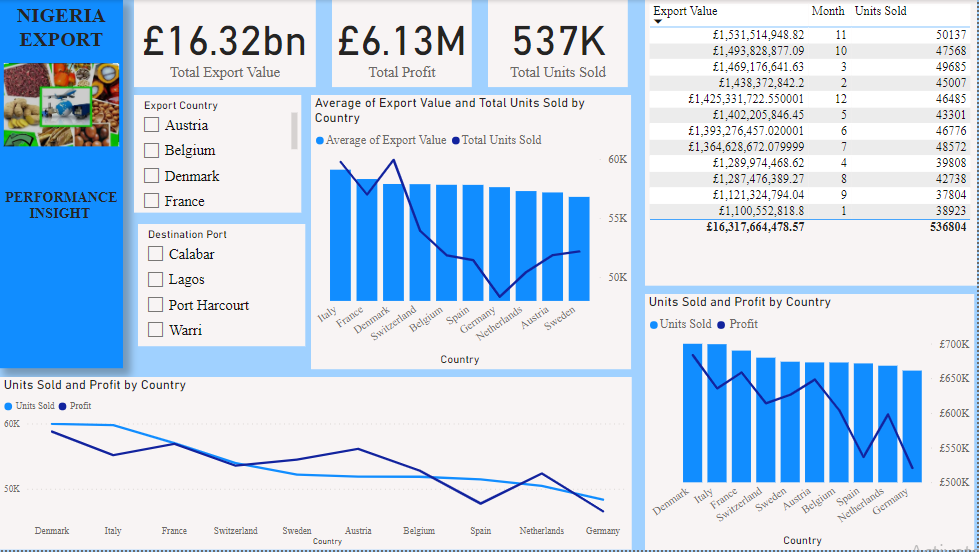
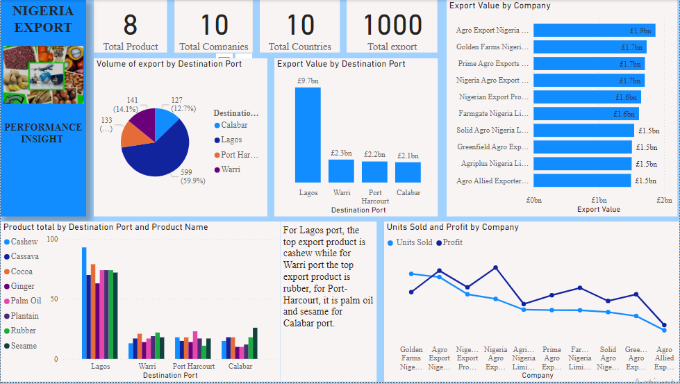
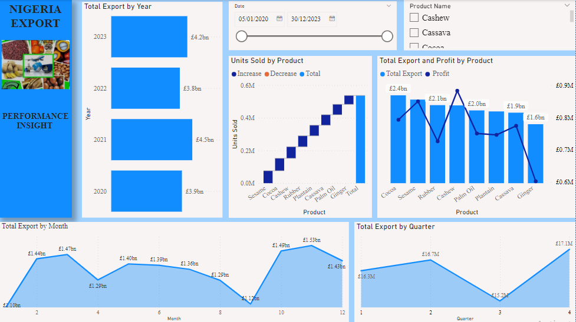

# Agricultural-Export-Insight
## INTRODUCTION

This is a PowerBI project on export analysis  of Nigeria agriculture Produce. The project is to analyze and derive insights to crucial questions and help the industry make data-driven decisions.

## PROBLEM STATEMENT
1. How do sales vary across different export countries 
2. Performance of different companies and destination ports
3. Profit margin of products and sales over time

## SKILLS/ CONCEPT DEMONSTRATED
The following Power BI features were incorporated:
1. Power Query
2. Page navigation 
3. DAX
4. Slicers
5. Data Visualization

## VISUALIZATION
The report comprises of three pages 
1. Export Countries
2. Company and Port
3. Year and product

## ANALYSIS
### Export Country 

The country currently has 8 countries of export with Denmark having the highest unit sold and profit 

### Company and Destination Port

A total of 10 companies and 4 destination port with Lagos having the highest export value of £9.7bn

### Product performance over time
 
The highest revenue of £4.5bn was generated in 2021 with a total of 10 agric product with highest profit from cashew at £882,676

## CONCLUSION &RECOMMENDATION 
### CONCLUSION
Aside Italy, France and Denmark, generating most revenue, Austria is the third most profitable country generating a very good profit of £648,395 for the nation. 

### RECOMMENDATION
Austria should be targetted with diversity of produce and port operation aside Lagos should be enhanced to facilitate more export from other regions of the country

